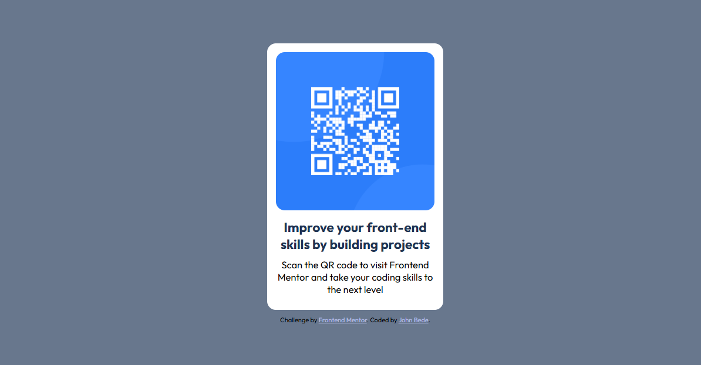

# Frontend Mentor - QR code component solution

## Table of contents

- [Overview](#overview)
  - [Screenshot](#screenshot)
  - [Links](#links)
- [My process](#my-process)
  - [Built with](#built-with)
  - [Continued development](#continued-development)
- [Author](#author)

## Overview

### Screenshot

### Links

- Solution URL: https://front-end-mentor-pearl.vercel.app/

## My process
- I created a container for the card and gave it a width and height
- Then added the image tag inside this container and applied a 100% width to take the full width of its container.
- i then applied a font size and family on the body tag
- added a flex display and gave it a column orientation to stack elements vertically
- in the qr-card i increased the font size of the title text and made it bold 
- created a universal selector to apply a margin to all elements.

### Built with

- Semantic HTML5 markup
- CSS custom properties
- Flexbox
- CSS Grid
- Mobile-first workflow

### Continued development

I'ld focus on improving my semantics and positioning of elements on the browser

## Author

- Website - 
- Frontend Mentor - (https://www.frontendmentor.io/profile/Bede-Ozy)
- Twitter - (https://www.twitter.com/ozuluonye_bede)
